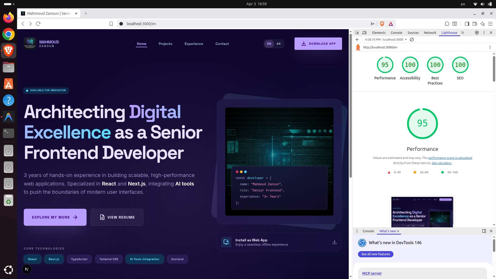
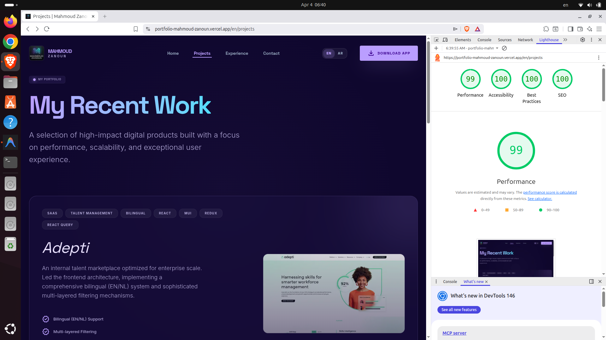
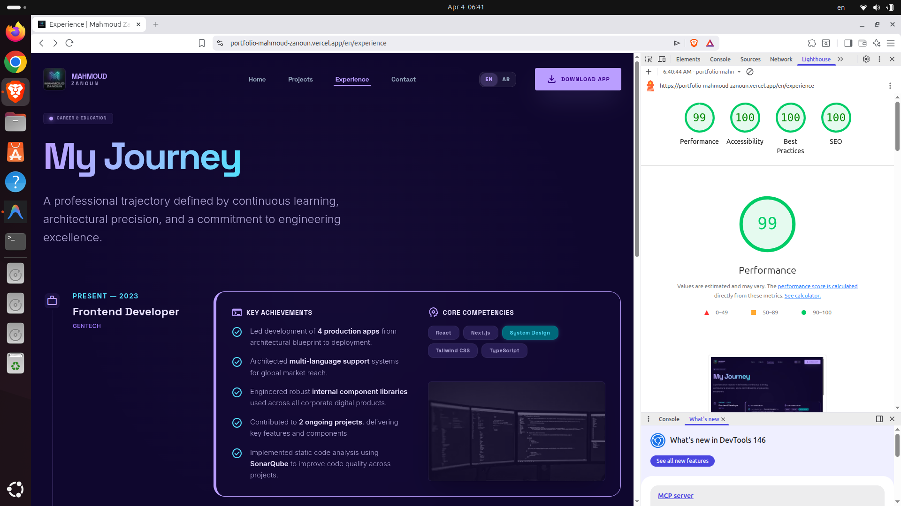
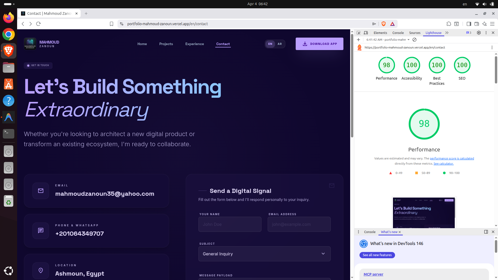

# Mahmoud Zanoun | Senior Frontend Engineer

Welcome to my personal 3D-integrated, Next.js 16 bilingual portfolio. Built with absolute obsession for performance, pristine UX, and dynamic internationalization. This platform serves as both a demonstration of top-tier software engineering standards and an interactive digital resume.

## 🚀 Performance Metrics

This architecture was built from the ground up to max out Google Lighthouse audits. It leverages native Next.js server components, extremely aggressive caching boundaries, strict local RTL logic, and React 19 concurrent boundaries.

### Lighthouse Scores

_Tested in pure production incognito against all key pages:_

| Home Page                                                                                  | Projects Page                                                                                      |
| ------------------------------------------------------------------------------------------ | -------------------------------------------------------------------------------------------------- |
|  |  |

| Experience Page                                                                                        | Contact Page                                                                                     |
| ------------------------------------------------------------------------------------------------------ | ------------------------------------------------------------------------------------------------ |
|  |  |

---

## 📱 Progressive Web App (PWA)

This portfolio is a fully functional, production-ready PWA, designed for a native-like experience on all devices.

- **Offline Resilience:** Custom-built "Signal Lost" fallback and persistent caching ensures the site works without an internet connection.
- **Tiered Caching:** High-performance Service Worker implementing deterministic Cache-First and Stale-While-Revalidate strategies.
- **Native Installation:** Custom UI hooks to trigger the official browser/OS installation dialog.
- **Optimized for Home Screen:** Clean branding with `short_name: "Mahmoud Z"` for perfect mobile icon labels.

---

## 💻 Tech Stack & Tooling

- **Framework:** Next.js 16 (App Router + Turbopack)
- **Language:** TypeScript
- **CI/CD:** GitHub Actions (Automated Quality Gate)
- **Styling:** Tailwind CSS (Strict Logical Properties)
- **UI Prototyping & Generation:** Designed entirely with **[Stitch](https://github.com/google-labs-code/stitch-skills)** to architect pixel-perfect layouts before coding.
- **Internationalization:** `next-intl` (Edge Proxy Architecture)
- **Form Handling:** EmailJS + Functional React Hooks
- **PWA Management:** Native Manifest Generator + Custom Service Worker
- **Package Manager & Runtime:** `bun`

---

## 🛠️ Getting Started

This repository relies exclusively on the **Bun runtime**.

1. **Install dependencies:**

   ```bash
   bun install
   ```

2. **Run the Development Server:**

   ```bash
   bun dev
   ```

3. **Type Check:**

   ```bash
   bun run type-check
   ```

4. **Lint Check:**

   ```bash
   bun run lint
   ```

5. **Build for Production:**
   ```bash
   bun run build
   bun run start
   ```

Open [http://localhost:3000](http://localhost:3000) with your browser to witness the result.

---

## 🌍 Core Architecture Highlights

- **AI-Augmented Design:** Every core component, layout boundary, and interactive state was initially modeled utilizing advanced structural generation via the **Stitch MCP** framework before rigorous manual React implementation.
- **Automated CI/CD:** Integrated GitHub Actions pipeline that enforces linting, type safety, and production build success for every Pull Request.
- **Native Edge Internationalization:** Replaced traditional heavy HOCs with full-stack Next.js 16 Middleware (Proxy) fallbacks.
- **RTL Fluidity:** Tailwind physical directions entirely ripped out and replaced with strict `start`, `end`, and `inset-s` classes for perfect mirroring.
- **Micro-Optimization:** Sub-10ms reconciliation via heavily constrained `useCallback` Hook memoization and strict `React.memo` barrier components.
- **Glassmorphism Design System:** Custom semantic palettes natively blending into OS-level dark/light schemes.
